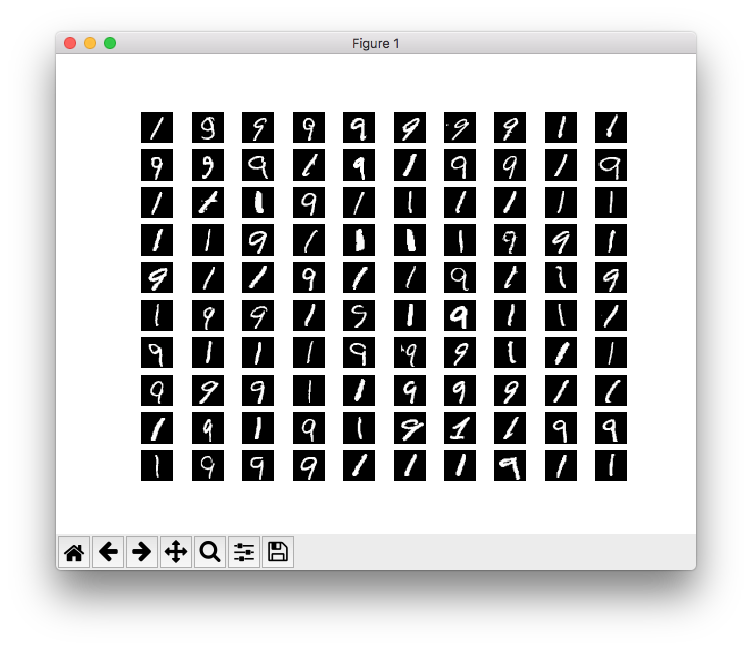
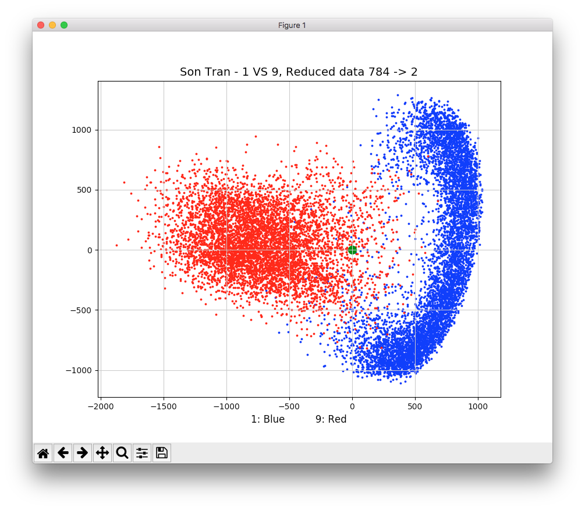
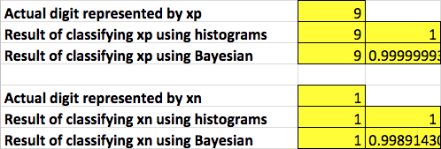
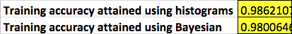

# machine-learning-number-recognition
Hand written number recognition by machine learning with MNIST dataset. Learning algorithms used are Histogram and Bayesian.

### Dataset 
* Dataset is obtained from <a href="http://yann.lecun.com/exdb/mnist/" target="_blank">Dr. Yan Lecun's website</a>Dr. Yan Lecun website. It's ready to be use and not modified in any way.
* Each data record is a 28x28 pixel grid (784 dimensions vector). This pixel grid captures a hand written pattern of numbers (from 0 to 9). In this algorithm, we are only intested in number 1 and 9.
* Selected data records of 1 and 9 in the dataset:

### Data dimension reduction
* Principle Component Analysis menthod is applied to reduce the dimension of data records.
* Only two most significant principal components are selected to represent the data.
* Dataset after dimension reduction:

### Training and prediction
* Histogram and Bayesian learning algorithms are built on dimension reduced dataset (2d)
* A Random pair of 1 and 9 is chosen from dataset and applied to both algorithms for prediction. In this particular case, results are quite accrurate:

### Training accruracy
* Both algorithms are used on the whole dataset to calculate the training accruracy:
