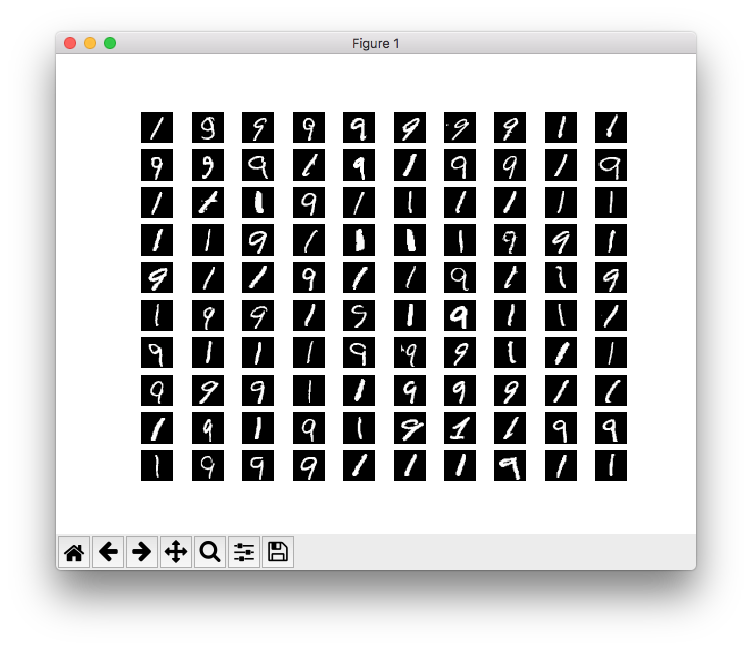
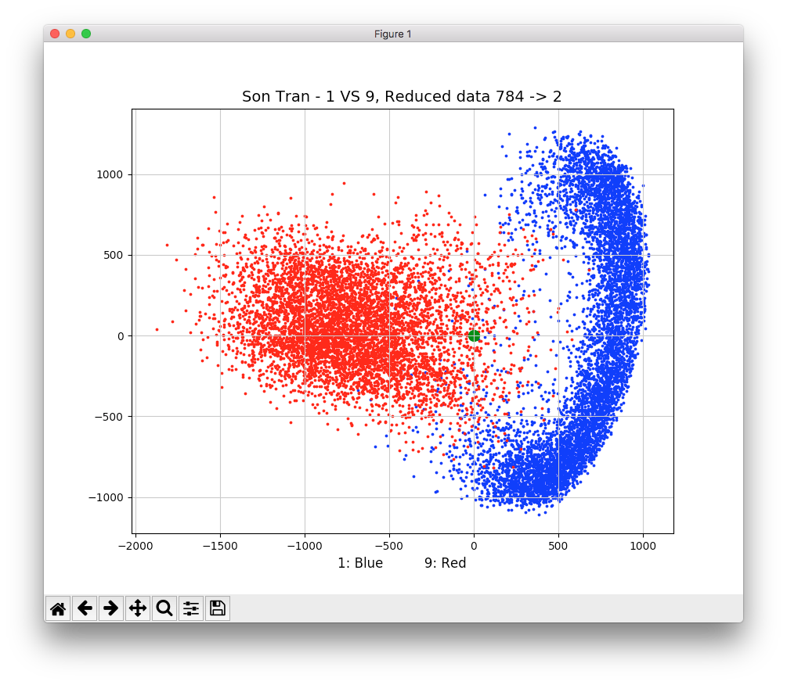
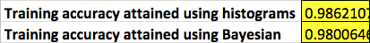

# Machine Learning - Hand written numbers recognition
Hand written number recognition by Histogram, Bayesian approach and principal components analysis method with <a href="http://yann.lecun.com/exdb/mnist/" target="_blank">MNIST dataset</a>.

### Dataset 
* Dataset is obtained from <a href="http://yann.lecun.com/" target="_blank">Dr. Yan Lecun's website</a>. It's ready to be use and not modified in any way.
* Each data record is a 28x28 pixel grid (784 dimensions vector). This pixel grid captures a hand written pattern of numbers (from 0 to 9). In this work, we are only intested in number 1 and 9.
* Selected data records of 1 and 9 in the dataset:

### Data dimension reduction
* <a href="https://en.wikipedia.org/wiki/Principal_component_analysis" target="_blank">Principle Component Analysis</a> menthod is applied to reduce the dimension of data records.
* Only two most significant principal components are selected to represent the data.
* Dataset after dimension reduction: 

### Training and prediction
* Histogram and Bayesian learning algorithms are built on dimension reduced dataset (2d)
* A Random pair of 1 and 9 is chosen from dataset and applied to both algorithms for prediction. In this particular case, results are quite accrurate: 

### Training accruracy
* Both algorithms are used on the whole dataset to calculate the training accruracy:

### Observations
* Histogram and Bayesian algorithms work mighty fine in this particular case!
* Although with a significant amount of dimension reduction (784 -> 2), PCA still captures a whole lot of information of the dataset. Hence, producing an impressive accuracy when predicting randomly picked number from the set. Although these numbers are from the training set itself, the accuracy of 98.6% for Histogram and 98% for Bayesian is impressive (once again, dimension is reduced from 784 to 2).
* When the prediction result is quite good, we should not be too excited and believe that dimension reduction is a magic tool. Looking back at scatter plot of reduced demension dataset, we can see by the nature of image capturing, number "1" and "9" are quite well seperated. Blue dots and red dots overlap with a minor amount. This is where Histogram data counting and Bayesian 2D works best. For more complicated problems, e.g. majority of red and blue dots overlap, we can't reduce the dataset to this low as 2.